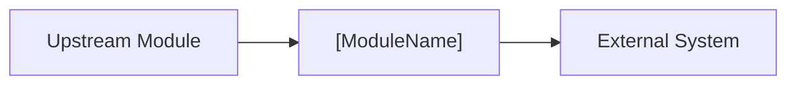

# [ModuleName] - Module Scope and ACL

Defines business boundaries, internal dependencies, external dependencies, and
anti-corruption interfaces.

## 1. Business Module Scope

- **Module Name**: [ModuleName]
- **Core Responsibility**: TBD
- **Includes**: TBD
- **Excludes**: TBD

## 2. Internal Dependencies

| module | interaction | direction | purpose | reference |
| :--- | :--- | :--- | :--- | :--- |
| TBD | RPC / DomainEvent / MQ | caller -> callee | TBD | `modules/[module]/index.md` |

## 3. External Dependencies and ACL

Rules:

- External calls go through `XxxSupport` interfaces.
- Support signatures use Entity, VO, or primitive types only.
- External DTOs stay inside `XxxSupportImpl`.

### 3.1 [External System]

- **Business Purpose**: TBD
- **Integration Type**: HTTP REST / gRPC / SDK / MQ
- **Support Interface**:

```java
public interface XxxSupport {
    Result doAction(DomainEntity entity);
}
```

| domain side | external side | conversion location |
| :--- | :--- | :--- |
| `Entity.field` | `ExternalDTO.extField` | `XxxSupportImpl` |

## 4. Dependency Topology


