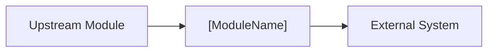

# [ModuleName] - Module Scope and ACL

Defines business boundaries, module dependencies, external dependencies, and
anti-corruption interfaces.

## 0. Baseline Delta (Feature Overlay Only)

Fill this section only when this file lives under
`features/{feature}/modules/{module}/...`. Baseline files should use
`N/A - baseline current valid`.

| change_type | baseline_ref | overlay_ref | change_summary | merge_action |
| :--- | :--- | :--- | :--- | :--- |
| `[reuse/add/extend/modify/deprecate]` | `modules/{module}/designs/acl.md#[section]` / `N/A` | `features/{feature}/modules/{module}/designs/acl.md#[section]` | change relative to baseline | no-op / add / merge / replace / remove |

## 1. Business Module Scope

- **Module Name**: [ModuleName]
- **Core Responsibility**: TBD
- **Includes**: TBD
- **Excludes**: TBD

## 2. Module Dependencies

| module | interaction | direction | purpose | reference |
| :--- | :--- | :--- | :--- | :--- |
| TBD | RPC / DomainEvent / MQ | caller -> callee | TBD | `modules/[module]/index.md` |

## 3. External Dependencies and ACL

Rules:

- External calls go through `XxxSupport` interfaces.
- Support signatures use Entity, VO, or primitive types only.
- External DTOs stay inside `XxxSupportImpl`.

### 3.1 [External System]

- **Business Purpose**: TBD
- **Integration Type**: HTTP REST / gRPC / SDK / MQ
- **Support Interface**:

```java
public interface XxxSupport {
    Result doAction(DomainEntity entity);
}
```

| domain side | external side | conversion location |
| :--- | :--- | :--- |
| `Entity.field` | `ExternalDTO.extField` | `XxxSupportImpl` |

## 4. Dependency Topology


