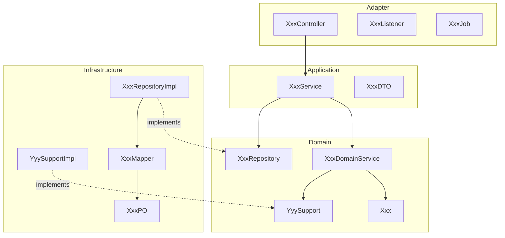

# [ModuleName] - Layered Component Design

Shows classes and interfaces in the selected architecture stack.

## 0. Baseline Delta (Feature Overlay Only)

Fill this section only when this file lives under
`features/{feature}/modules/{module}/...`. Baseline files should use
`N/A - baseline current valid`.

| change_type | baseline_ref | overlay_ref | change_summary | merge_action |
| :--- | :--- | :--- | :--- | :--- |
| `[reuse/add/extend/modify/deprecate]` | `modules/{module}/designs/component.md#[section]` / `N/A` | `features/{feature}/modules/{module}/designs/component.md#[section]` | change relative to baseline | no-op / add / merge / replace / remove |

## Component Diagram



## Component Inventory

| class | layer | responsibility | notes |
| :--- | :--- | :--- | :--- |
| `XxxController` | Adapter | transport entry | |
| `XxxService` | Application | orchestration and transaction boundary | |
| `XxxDomainService` | Domain | core domain behavior | |
| `XxxRepository` | Domain | repository interface | |
| `XxxRepositoryImpl` | Infrastructure | repository implementation | |
| `YyySupportImpl` | Infrastructure | external integration adapter | |

## Interface Contracts

### Repository

```java
public interface XxxRepository {
    Optional<Xxx> findById(Long id);
    void save(Xxx entity);
}
```

### Application Service

```java
public interface XxxService {
    XxxDTO doAction(XxxDTO command);
}
```

## Done

- [ ] Dependency direction follows selected tech contracts.
- [ ] Method signatures match model and ACL specs.
- [ ] Support interfaces are referenced, not duplicated, from `acl.md`.
