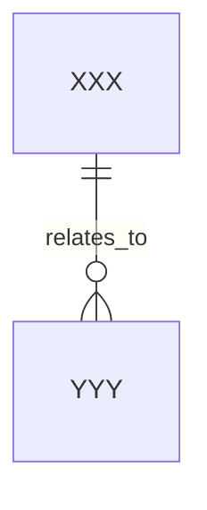

# [ModuleName] - Domain Model

## 0. Baseline Delta (Feature Overlay Only)

Fill this section only when this file lives under
`features/{feature}/modules/{module}/...`. Baseline files should use
`N/A - baseline current valid`.

| change_type | baseline_ref | overlay_ref | change_summary | merge_action |
| :--- | :--- | :--- | :--- | :--- |
| `[reuse/add/extend/modify/deprecate]` | `modules/{module}/designs/model.md#[section]` / `N/A` | `features/{feature}/modules/{module}/designs/model.md#[section]` | change relative to baseline | no-op / add / merge / replace / remove |

## 1. Ubiquitous Language

| code term | business term | definition | source |
| :--- | :--- | :--- | :--- |
| TBD | TBD | TBD | TBD |

## 2. Entities

| entity | field | type | constraint | invariant |
| :--- | :--- | :--- | :--- | :--- |
| `Xxx` | `id` | `Long` | required | immutable identity |

## 3. Value Objects

| value object | field | type | constraint |
| :--- | :--- | :--- | :--- |
| `XxxVO` | `value` | `String` | required |

## 4. State Transitions

| object | source state | trigger | target state | rule |
| :--- | :--- | :--- | :--- | :--- |
| `Xxx` | `INIT` | `submit()` | `ACTIVE` | TBD |

## 5. Domain ER Diagram

## 6. Error Codes

| error code | trigger | message |
| :--- | :--- | :--- |
| `XXX_INVALID` | TBD | TBD |
