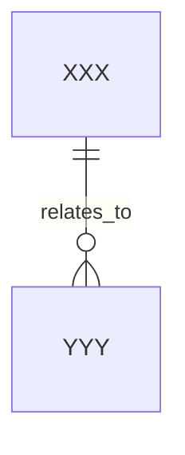

# [ModuleName] - Domain Model

## 1. Ubiquitous Language

| code term | business term | definition | source |
| :--- | :--- | :--- | :--- |
| TBD | TBD | TBD | TBD |

## 2. Entities

| entity | field | type | constraint | invariant |
| :--- | :--- | :--- | :--- | :--- |
| `Xxx` | `id` | `Long` | required | immutable identity |

## 3. Value Objects

| value object | field | type | constraint |
| :--- | :--- | :--- | :--- |
| `XxxVO` | `value` | `String` | required |

## 4. State Transitions

| object | source state | trigger | target state | rule |
| :--- | :--- | :--- | :--- | :--- |
| `Xxx` | `INIT` | `submit()` | `ACTIVE` | TBD |

## 5. Domain ER Diagram

## 6. Error Codes

| error code | trigger | message |
| :--- | :--- | :--- |
| `XXX_INVALID` | TBD | TBD |
