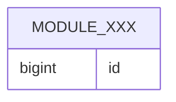

# [ModuleName] - Persistence Design

## 1. PO Definitions

| entity | PO class | table | notes |
| :--- | :--- | :--- | :--- |
| `Xxx` | `XxxPO` | `[module]_xxx` | VO fields are flattened |

## 2. Entity to PO Mapping

| entity field | PO column | conversion |
| :--- | :--- | :--- |
| `id` | `id` | direct |

## 3. Index Design

| table | index | columns | reason |
| :--- | :--- | :--- | :--- |
| `[module]_xxx` | `uk_xxx_id` | `id` | identity lookup |

## 4. Database ER Diagram



## 5. DDL

```sql
CREATE TABLE module_xxx (
  id BIGINT PRIMARY KEY
);
```

## 6. Capacity and Storage

| item | estimate | conclusion |
| :--- | :--- | :--- |
| average writes | N/A | reuse existing capacity |
| storage growth | N/A | no special design |
