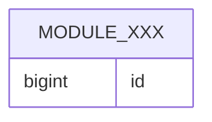

# [ModuleName] - Persistence Design

## 0. Baseline Delta (Feature Overlay Only)

Fill this section only when this file lives under
`features/{feature}/modules/{module}/...`. Baseline files should use
`N/A - baseline current valid`.

| change_type | baseline_ref | overlay_ref | change_summary | merge_action |
| :--- | :--- | :--- | :--- | :--- |
| `[reuse/add/extend/modify/deprecate]` | `modules/{module}/designs/persistence.md#[section]` / `N/A` | `features/{feature}/modules/{module}/designs/persistence.md#[section]` | change relative to baseline | no-op / add / merge / replace / remove |

### Reuse Decision Gate

| scope_slice | checked_candidates | reuse_decision | add_justification |
| :--- | :--- | :--- | :--- |
| `model.md` / `design_brief §...` | baseline/source tables, mappings, indexes, and existing persistence rules checked | `reuse/extend/modify/add/MANUAL_DECISION` with reason | Every `add` names source evidence and why reuse/extension is not correct; use `N/A` when there are no additions. |

## 1. PO Definitions

| entity | PO class | table | notes |
| :--- | :--- | :--- | :--- |
| `Xxx` | `XxxPO` | `[module]_xxx` | VO fields are flattened |

## 2. Entity to PO Mapping

| entity field | PO column | conversion |
| :--- | :--- | :--- |
| `id` | `id` | direct |

## 3. Index Design

| table | index | columns | reason |
| :--- | :--- | :--- | :--- |
| `[module]_xxx` | `uk_xxx_id` | `id` | identity lookup |

## 4. Database ER Diagram

Table-level diagram that complements `model.md §5` domain relationships.



## 5. DDL

```sql
CREATE TABLE module_xxx (
  id BIGINT PRIMARY KEY
);
```

## 6. Capacity and Storage

| item | estimate | conclusion |
| :--- | :--- | :--- |
| average writes | N/A | reuse existing capacity |
| storage growth | N/A | no special design |
