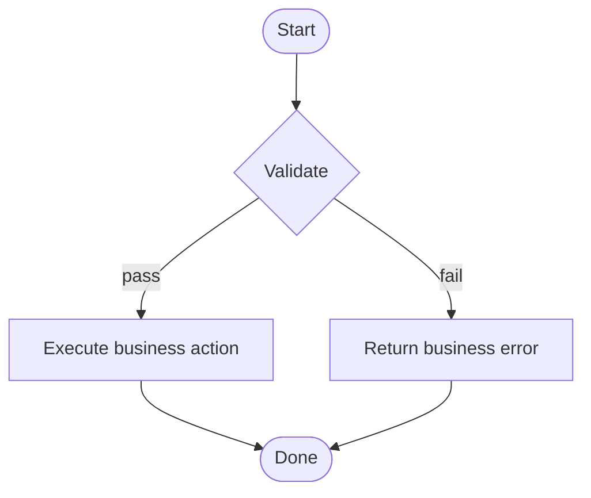
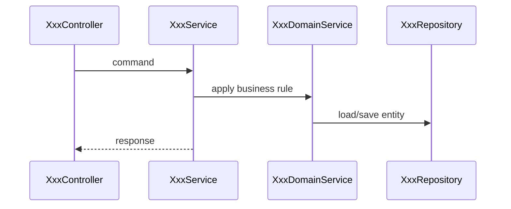

# Flow: [ScenarioName]

Scenario-level behavior and call-chain design.

## 1. Approval Checklist

| check | result | note |
| :--- | :--- | :--- |
| external entrance reviewed | TBD | |
| transaction boundary reviewed | TBD | |
| idempotency reviewed | TBD | |
| capacity reviewed | TBD | |

## 2. Model Summary

| entity | fields used | states used |
| :--- | :--- | :--- |
| `Xxx` | TBD | TBD |

## 3. Entrance Summary

| field | value |
| :--- | :--- |
| exposed | yes / no |
| caller | TBD |
| auth | TBD |
| compatibility | TBD |

## 4. Business Activity Diagram

## 5. Sequence Diagram

## 6. Exception Handling

| scenario | error code | location | handling |
| :--- | :--- | :--- | :--- |
| TBD | `XXX_INVALID` | AppService | throw AppException |

## 7. Robustness Constraints

| target | transaction | idempotency | concurrency | capacity |
| :--- | :--- | :--- | :--- | :--- |
| `XxxService.process()` | required | N/A | N/A | reuse existing |

## Done

- [ ] Entrance spec is created when the flow adds or changes an exposed entry.
- [ ] New model changes are reflected in `model.md`.
- [ ] New error codes are reflected in `model.md`.
- [ ] Sequence participants match `component.md`.
