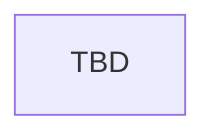

# System Architecture

## 1. System Positioning

**System Name**: TBD
**Business Scope**: TBD
**Core Responsibilities**: TBD

## 2. Module Overview

### Module Inventory

| module | responsibility | spec path | status |
| :--- | :--- | :--- | :--- |
| TBD | TBD | `modules/[name]/index.md` | pending |

### Module Dependency Graph

## 3. External Entrances

| module | entrance | method | endpoint | path |
| :--- | :--- | :--- | :--- | :--- |
| TBD | TBD | TBD | TBD | `modules/[module]/entrances/[entrance].md` |
